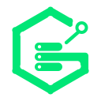
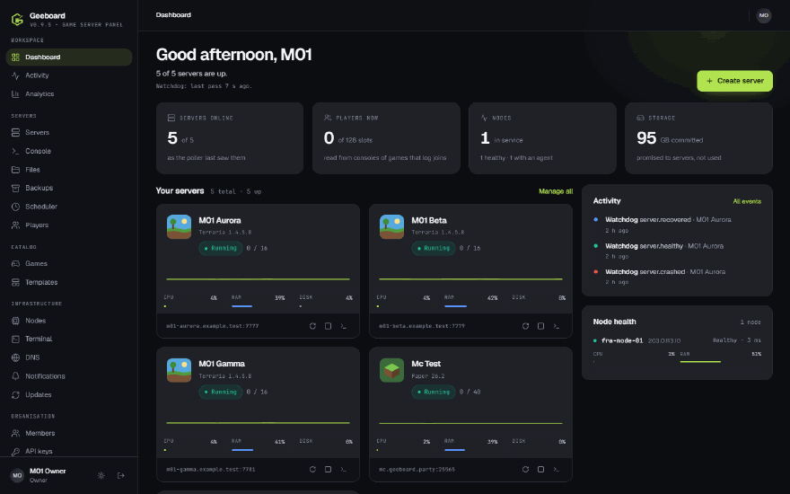
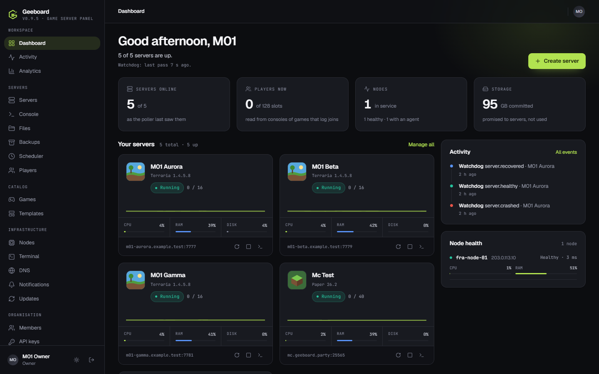
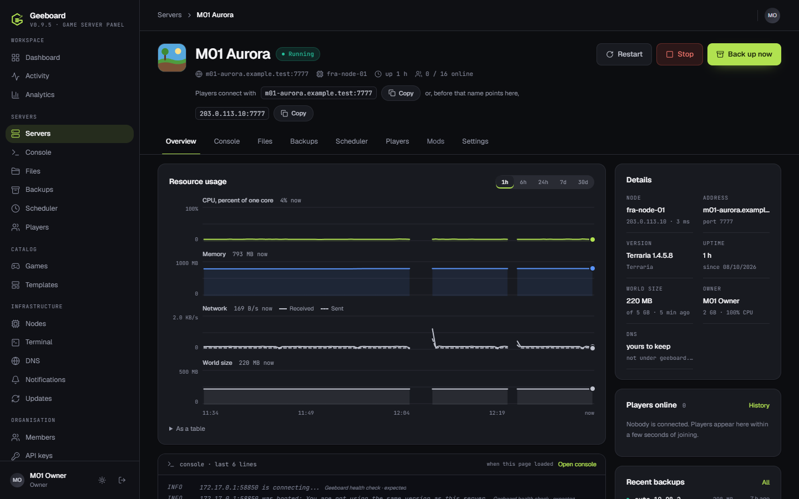
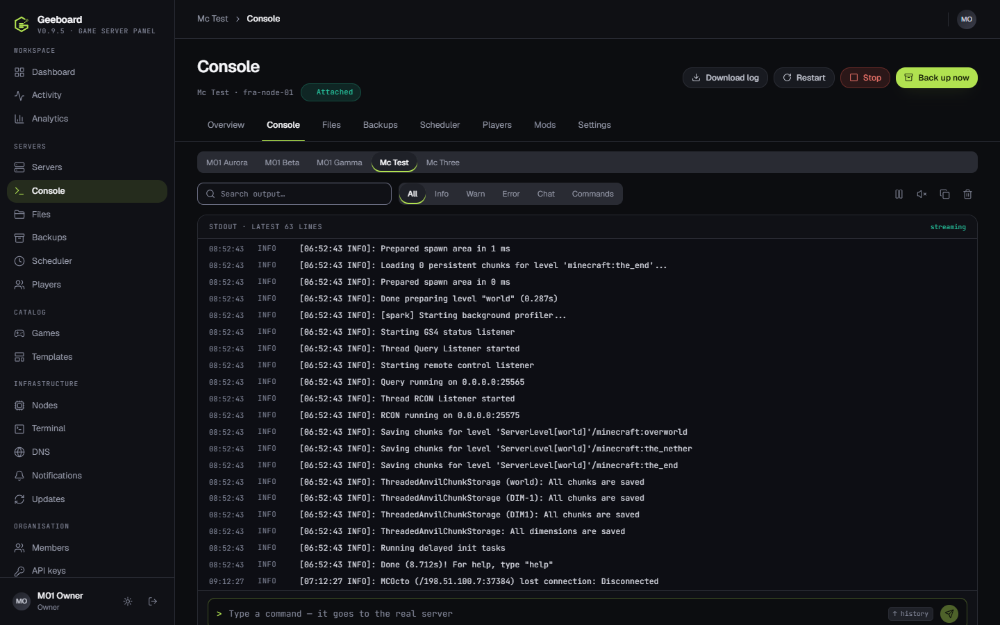
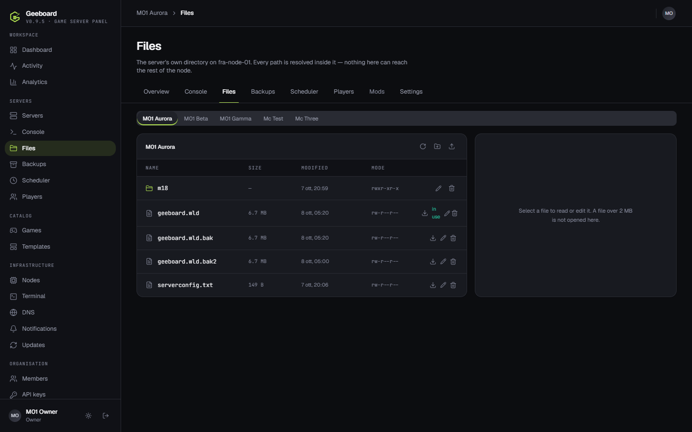
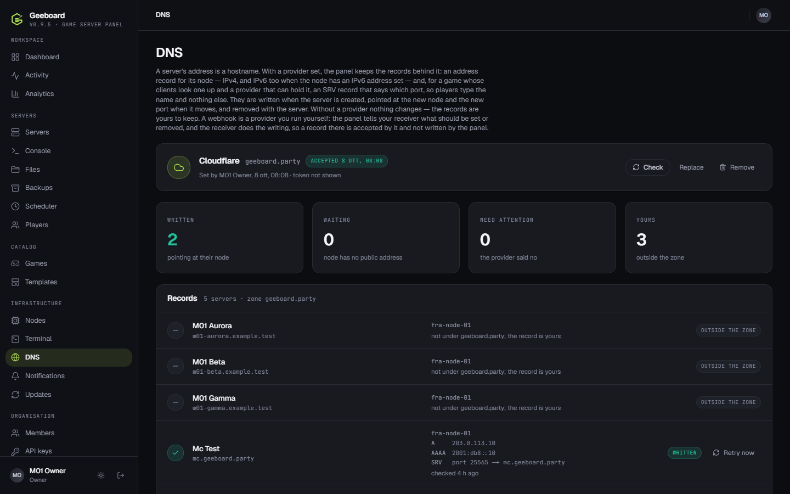
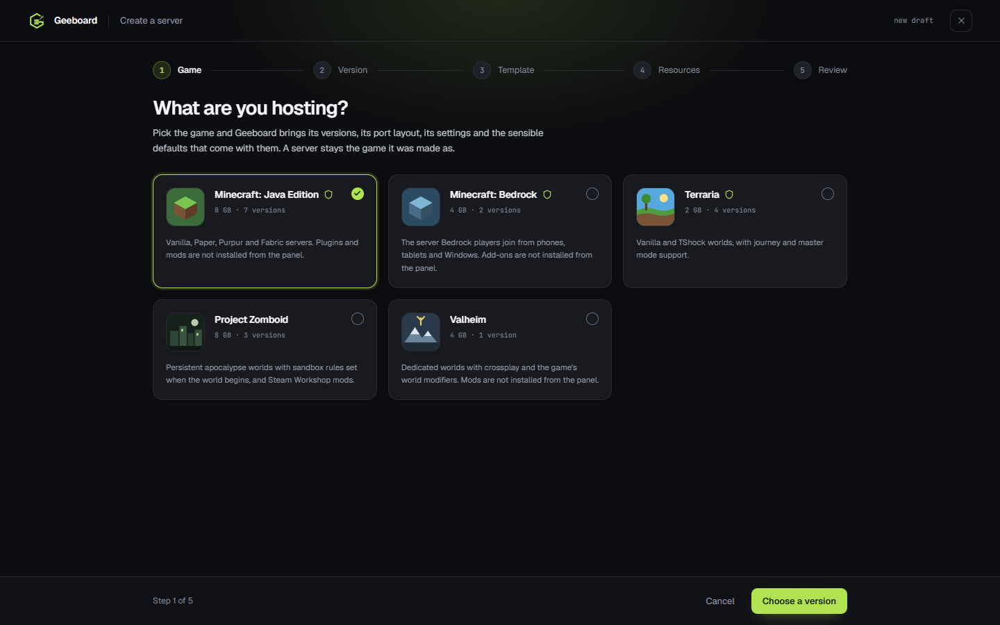

# Geeboard

**An open-source panel that runs game servers on machines you already have.** You bring the machines;
Geeboard puts a small agent on each, and from one panel you create servers, watch their consoles, edit their
files, back them up, move them between machines, give them an address players can type, and hear about it when
something breaks. No cloud account, no per-server fee, no Kubernetes.



<sub>The screenshots here are of a real panel on a small VPS, running Terraria and Minecraft; the machine's address is replaced.</sub>

It is not a Docker dashboard. Docker is how a machine happens to run a server today; the panel, the API and the
database speak in games, versions, nodes and servers, and any one of those could change without the others.

## What it does

- **Five games run for real** — Minecraft: Java, Minecraft: Bedrock, Terraria (vanilla and TShock), Valheim and
  Project Zomboid — each with its own versions, settings, port layout and health check, which asks the game and not
  the container. A game somebody else wrote can be added as a reviewed manifest ([community games](docs/community-games.md)).
- **A live console** and a **file manager** (read, edit, upload, rename, download) that cannot leave a server's folder.
- **Backups that are checked before they are trusted**: archived and hashed on the node, verified, restored beside the
  world and swapped; off-site to any S3-compatible bucket if you want one.
- **Addresses people can type**: with a Cloudflare or DuckDNS token (or a webhook of your own) the panel writes the
  `A`, `AAAA` and `SRV` records, so `mc.example.com` reaches a Minecraft server on any port.
- **Nodes** on any Linux machine, or a Windows PC; the panel is told when one goes quiet, and servers are moved between them.
- **Notifications** to Discord or a signed webhook; **an HTTP API** that does what the pages do; **roles** (owner, admin,
  moderator, member) with one permission table behind both.
- **It tells you when a newer Geeboard is out**, and whether it is an update, a recommendation or a security fix. Upgrading
  dumps your database first and prints how to go back.

## Install it

On a Linux machine with Docker and git (a new Debian or Ubuntu has neither:
`sudo apt-get install -y git curl`, then `curl -fsSL https://get.docker.com | sudo sh`):

```bash
git clone --branch stable https://github.com/DanieleMarino70/Geeboard.git
cd Geeboard
sudo bash deploy/linux/install-panel.sh
```

It asks whether you have a domain name and who the first owner is, and does the rest: the secrets, the configuration,
https either way, the containers, the database and the first account. Run it again to upgrade — it takes a dump of the
database first, never regenerates a secret it already wrote, and never removes a volume or a game server.
[Install Geeboard](docs/production.md) is the whole of it; every step by hand is [Advanced installation](docs/advanced-install.md).

## A look

| | |
| --- | --- |
|  **Dashboard** — servers, nodes, activity |  **A server** — usage, address, details, backups |
|  **Console** — live, searchable, with what the panel's own health checks print marked as expected |  **Files** — in the server's folder, and nowhere else |
|  **Addresses** — the records the panel keeps for each server |  **A new server** — game, version, template, resources, review |

## What has been run, and what has not

Everything above was run on real machines before 0.9.5: a clean Debian VPS with a real certificate and a real DNS zone,
Ubuntu 22.04 and 24.04, a Windows PC, and CI — [what was run](docs/release-matrix.md) says each situation and what happened
in it, including the upgrade from the previous release, going back, and bringing a lost panel back from a dump.
0.9.5 was also read end to end by independent reviewers, and what they found is fixed or written down
([the list](docs/limitations.md#found-by-the-audit-of-095-and-left)). **What is not proved is written down too**, in one place
(IPv6 from outside the machine, the official Minecraft client through an SRV record, a screen reader, a clean Windows PC, arm64),
and [limitations](docs/limitations.md) is worth reading before you plan around any of it. The images carry a bill of materials
and are signed ([Verifying an image](docs/security.md#verifying-an-image)).

## Or try it on a laptop

```bash
docker compose up -d           # Postgres
cd web && npm install && npm run setup:env && npm run db:migrate
npm run db:seed && npm run dev # http://localhost:3000
```

Sign in as `mara@ashfold.gg` / `geeboard` — the development seed's account, whose password is written in this
repository, which is exactly why it refuses to run in production.

## Documentation

**<https://danielemarino70.github.io/Geeboard/>** — install, add a node, operate, upgrade, the HTTP API, security,
architecture, the roadmap, and what does not work yet.

The same pages are in [docs/](docs/) and read on GitHub as they are. [CHANGELOG.md](CHANGELOG.md) is what changed
between releases, [docs/upgrading.md](docs/upgrading.md) is how to move from one to the next, and
[SECURITY.md](.github/SECURITY.md) is how to report a problem.

```
                          Geeboard Panel
                                │
                          Control API
                                │
              ┌─────────────────┴─────────────────┐
              │                                   │
        Game catalog                        Node registry
      games · versions                            │
      config · health              ┌──────────────┼──────────────┐
                                   │              │              │
                                Node           Node           Node
                              Frankfurt        Milan        Amsterdam
                                   │              │              │
                                Runtime        Runtime        Runtime
                                   │              │              │
                             Game servers   Game servers   Game servers
```

## Licence

Geeboard is licensed under the GNU Affero General Public License, version 3
only — `AGPL-3.0-only`. The full text is in [LICENSE](LICENSE).

The name **Geeboard** and the mark in `brand/` are not part of that grant —
see [brand/LICENSE.txt](brand/LICENSE.txt). The software is yours to fork; the
badge on it is not, so a fork does not ship as Geeboard.

In short, and not in place of the licence: you may use, study, change and share
it. If you share a changed version, or run one that other people use over a
network — a hosted panel is exactly that — you have to offer them its source
under the same licence (section 13). "Only" means a later version of the
licence does not apply unless the project chooses it.

The games are not part of Geeboard. A node pulls each game's server from its
own image, under that image's and that game's terms — Minecraft's image, for
one, is started with `EULA=TRUE`, which accepts Mojang's EULA on the operator's
behalf.
